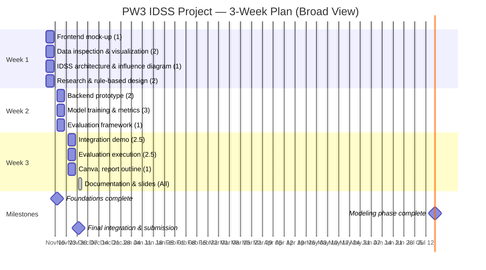

# Flood-IDSS: Intelligent Decision Support System for Flood Management

## Project Overview

Flood-IDSS is an intelligent decision support system designed to assist in flood risk assessment, prediction, and management. This project leverages machine learning and data analytics to provide actionable insights for flood prevention and response strategies.

## Goals

- **Risk Assessment**: Analyze historical and real-time data to assess flood risks in different regions
- **Prediction Models**: Develop machine learning models to predict flood events and their severity
- **Decision Support**: Provide interactive tools and dashboards for decision-makers
- **Data Integration**: Integrate multiple data sources (meteorological, hydrological, geographical)
- **Visualization**: Create intuitive visualizations for complex flood-related data

## Project Structure

```
mai-idss-flood/
├── Documentation/     # Project documentation, reports, and technical specifications
├── Data/             # Raw and processed datasets (excluded from version control)
├── Models/           # Trained ML models and model artifacts
├── Source/           # Source code for data processing, models, and applications
├── Demo/             # Demo scripts and sample applications
├── Presentation/     # Presentation materials, slides, and visual assets
├── README.md         # This file
├── requirements.txt  # Python dependencies
└── .gitignore       # Git ignore rules
```

### Directory Descriptions

- **Documentation/**: Contains all project documentation including design documents, API specifications, user guides, and weekly progress reports.

- **Data/**: Houses all data files including raw datasets, processed data, and intermediate outputs. Note: Data files are excluded from version control to maintain repository size.

- **Models/**: Stores trained machine learning models, model checkpoints, and serialized model artifacts.

- **Source/**: Contains all source code organized by functionality (data preprocessing, feature engineering, model training, API endpoints, web application).

- **Demo/**: Includes demonstration scripts, Jupyter notebooks, and sample applications showcasing system capabilities.

- **Presentation/**: Contains presentation slides, figures, diagrams, and other materials for project presentations and deliverables.

## Technology Stack

- **Python 3.x**: Core programming language
- **Streamlit**: Interactive web application framework
- **FastAPI**: High-performance API framework
- **scikit-learn**: Machine learning library
- **Additional libraries**: See `requirements.txt` for complete list

## Getting Started

### Prerequisites

- Python 3.8 or higher
- pip package manager

### Installation

1. Clone the repository:
   ```bash
   git clone https://github.com/alobo01/mai-idss-flood.git
   cd mai-idss-flood
   ```

2. Install dependencies:
   ```bash
   pip install -r requirements.txt
   ```

3. Run the application:
   ```bash
   # For the Streamlit dashboard
   streamlit run Source/app.py
   
   # For the FastAPI backend
   uvicorn Source.api:app --reload
   ```

## Development Workflow

### Branching Strategy

- **dev**: Main development branch for collaboration
- Feature branches: Create from `dev` for new features
- Pull requests: Required for all changes to `dev`

### Weekly Deliverables

1. Create a feature branch from `dev`
2. Implement changes and commit regularly
3. Submit a pull request with detailed description
4. Code review and merge to `dev`

### Contribution Guidelines

- Follow PEP 8 style guide for Python code
- Write descriptive commit messages
- Document all functions and classes
- Include tests for new functionality
- Update documentation as needed

### Gantt Diagram:


## Detailed Task Descriptions

### Week 1 — Foundations & Research

**1. Frontend Mock-Up (Antonio)**
Design an initial Streamlit interface showing three main user roles: *Administrator*, *Planner*, and *Coordinator*. Include placeholders for a risk map, flood alerts, and resource allocation results. This mock-up defines the future UI structure and interaction flow.

**2. Data Inspection & Visualization (Andras, Nour)**  
Load and explore the dataset. Identify missing values, data distributions, and correlations between key hydrological and meteorological variables. Generate visual summaries (heatmaps, scatterplots, histograms) to guide model design and feature selection.

**3. IDSS Architecture & Influence Diagram (Thibault)**  
Draft the high-level system architecture showing data ingestion, model inference, and knowledge-based reasoning. Create an influence diagram illustrating relationships between rainfall, river flow, risk zones, and response actions.

**4. Research & Rule-Based Design (Karitas, Sabrina)**  
Review 5–7 recent papers on flood risk modeling and decision support. Summarize their contributions and gaps. From this analysis, design the **rule-based resource allocation approach** — defining prioritization rules (e.g., hospitals > schools > households) and response thresholds to complement the data-driven model.

---

### Week 2 — Modeling & Evaluation Preparation

**5. Backend Prototype (2 people)**  
Develop a lightweight FastAPI backend exposing endpoints for `/predict` (risk model) and `/allocate` (rule engine). Connect to the frontend mock-up using JSON responses. The backend should simulate data exchange between modules.

**6. Model Training & Metrics (2 people)**  
Preprocess data and train a baseline predictive model (Random Forest or LightGBM). Evaluate its performance with metrics like ROC-AUC, precision, recall, and calibration. Store model artifacts under `/Models/` and document key findings.

**7. Evaluation Framework (1 person)**  
Define the evaluation plan for the complete IDSS. Include both quantitative (accuracy, runtime, explainability) and qualitative (user satisfaction, trust, interpretability) metrics. Specify how the flood-risk model and rule-based system will be jointly assessed.

**8. Literature Update (1 person)**  
Integrate additional references supporting the architecture, modeling, and rule-based reasoning. Add a “Related Work” subsection to the documentation summarizing key contributions and their influence on Flood-IDSS.

---

### Week 3 — Integration, Deployment & Evaluation

**9. Integration Demo (2 people)**  
Combine the frontend, backend, and trained models into a functional prototype. Display predicted risk levels and recommended allocations for selected zones. Record a 3–5 minute video showcasing the system’s main capabilities.

**10. Evaluation Execution (2 people)**  
Run the evaluation plan defined in Week 2. Compare model predictions with ground truth, analyze rule-based allocation performance, and assess decision quality. Document results in the evaluation section of the report.

**11. Deployment Plan & Canva Revision (1 person)**  
Redesign the *Deployment* section of the Canva to include real-world deployment stages: sensor installation, system integration with municipal infrastructure, coordination with emergency services, and stakeholder acceptance strategy.

**12. Documentation & Slides (All)**  
Finalize the project report and presentation. Ensure all sections (architecture, data preprocessing, models, rule base, evaluation, deployment, and future work) are complete. Prepare up to 15 slides summarizing the workflow, results, and conclusions.

---

### Milestones

- **M1: Foundations complete (Week 1)** – Architecture, rule design, and initial mock-up delivered.  
- **M2: Modeling phase complete (Week 2)** – Model, backend, and evaluation framework ready.  
- **M3: Final integration & submission (Week 3)** – Full demo, evaluation, and deployment plan submitted.

## Team

- Project repository: [alobo01/mai-idss-flood](https://github.com/alobo01/mai-idss-flood)

## License

[Add license information here]

## Contact

[Add contact information here]
